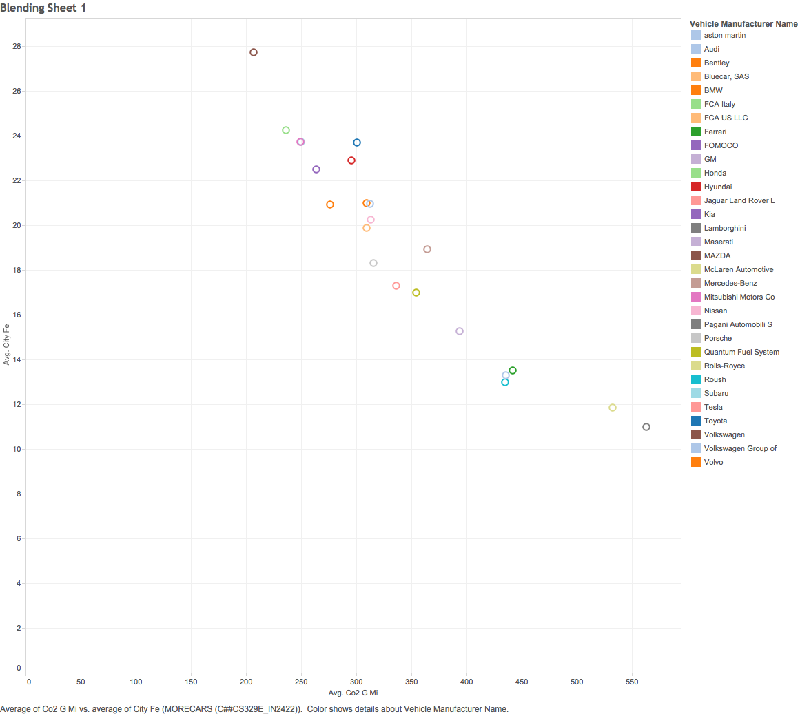

---
title: 'Data Visualization:   
Final Project'
output: html_document
---  
## By: Azaam Jamil, Blake Kappel, Ibrahim Nagib


##### This html page, was produced by creating an R markdown document, and using KnitR to knit the file into html. The purpose of this html file, is to show a visual analysis of our data set in Tableau, R Studio, and Shiny. 

### Final Project Folders:

* **00 Doc**
    + rmd and html
* **01 Data**
    + etl.R files
* **03 Tableau Workbooks**
    + .twbx and all .png files of tableau worksheets
* **04 Shiny**
    + ui.R and server.R files for Shiny application
* **Rprofile.R**
    + for simplification (required packages)


### Rprofile.R:
An Rprofile.R document was created to include all of the packages required for the project, in order to avoid requiring packages in each of the R script files. Below is the call to the Rprofile document, and shows the necessary packages being loaded:


```{r}
source("../Rprofile.R", echo = FALSE)
```


### Data:
The data set we chose to analyze and visualize is a data set of tested vehicles. A group of 2016 vehicles were tested for various measures including horsepower, carbon emmissions, nitrogen emmisions, engine displacement, and various other measures. For the last few visualizations, the original data set was blended with another data set, showing the fuel consumption(hwy and city) for the same vehicles. We used a modified R_ETL.R file to move the data into an SQL server.


### Our Pre-Analysis hypothesis:
Before starting our analysis, we first discussed some of the results that we expected to see. We discussed what visualizations we wanted, and how the visualizations could help prove or support our hypothesis.   
Expectations: 

* positive correlation between horsepower, carbon dioxide emmissions, and N2O emmissions   
    + as horsepower increases, we expect to see an overall increase in CO^2^, and N^2^O   
* strong positive correlation between egnine displacement, horsepower, and fuel economy   
    + naturally, we believe a larger engine will produce more horsepower, and be less fuel efficient.  

### Methodology for Data Analysis:

1. Start with a	measure	in	non-aggregated mode and make a Boxplot	
2. Start with a measure thing in aggregated mode and make a Histogram	
3. Start with	two measures and make a Scatter plot	
4. Start with	two	dimensions plus	a	measure	and	make a Crosstab	
5. Start with a dimension	and	a	measure and make a Barchart

### Box-Plot :
The box-plot below shows a reasonable expectation of car manufacturer's rated horse powers. As we had predicted, most vehicles are in a mid-range horse power, with few outliers in very low or very high horse power ranges. The exceptions, we found to be manufacturers that made only powerful super cars.

* sorted by median horsepower ascending
* highest median and highest HP is by Pagani Automobil S
* lowest median HP is bluecar SAS


### Histogram :
Below is a histogram showing the normal curve of rated horse power. As expected, most of the vehicles are in the mid range for horsepower, with few vehicles on either tale end of the bell curve.

* Started with a "green thing"" in aggregated mode (count of rated horsepower)
* Count of horsepower : height
* CO^2^ emissions : Color
    + shade of blue, the lighter the color the greater the CO^2^ emission


### Scatter Plot:
The scatter plot shows horse power on the x-axis and CO2 emissions on the y-axis. As we expected there is a positive correlation between the two measure variables. The visualization shows a trend of increased carbon dioxide emissions with increases in horesepower. The colors represent different vehicle types, also as expected, trucks tend to have higher emissions than cars. 


### Cross-Tab :
Below is another visualization of a subset of the data. For this visualization, we wanted to observe a cross tab of vehicle types, car makes, and the calculated engine efficiency of the vehicles. Engine efficiency was calculated by dividing the horsepower by the engine displacement, or size of the engine in Liters. Parameters were set for high and low engine efficiency and used to compare all of the vehicles in the cross-tab. 


### Bar Graph :
Below is a visualization of a subset of the data. We thought it would be insightful to see how the variables changed over the time period between 2000 and 2012. As The faceted graph shows, there is a trickling of data points, representing countries, from the lower end of the graph to the upper end of the graph showing that literacy rates were improving through the years. It was surprising however to see that percentage of GDP spent on education seemed to play little role in the improvement of youth literacy rates over the years. This is similar to the visualization made for the previous project in Tableay, but made in R studio.


### Shiny App:
We used Shiny, to build an app to demonstrate our more interesting visualizations and group them together in a neat dashboard.  
[Shiny App](https://kappelblake.shinyapps.io/FinalProject)

### Tableau Blended Scatter Plot :
The below visualization was done by blending our two data sets, since both data sets have similarites such as vehicle manufacturer, the two sets were easily blended and produced some expected results when we compared rated horsepower of cars from one data set, to the fuel efficiency in the other data set. As the visualization shows, the relationship is inverse; the greater the horsepower, the lower the fuel efficiency.



### Tableau Blended Scatter Plot :
With the data sets blended, we also decided to visuaize carbon dioxide emissions vs fuel efficiency in cars. We suspected that higher fuel efficiency vehicles would have less carbon dioxide emission, showing another negative correlation in the visualization.


### Tableau Blended Scatter Plot:
With the data sets blended, we also decided to visuaize carbon dioxide emissions vs fuel efficiency in cars. We suspected that higher fuel efficiency vehicles would have less carbon dioxide emission, showing another negative correlation in the visualization.


### Conclusion:
Through data analysis and visualization, we were able to prove our original hypothesis. The graphs visually supported our hypothesized assumptions about correlation between horse power, emissions, engine displacement, and fuel economy. Although we did not find anything that was extreme or out of the ordinary, the visualizations served exactly their function, to help us visualize expected relationships in the data.

